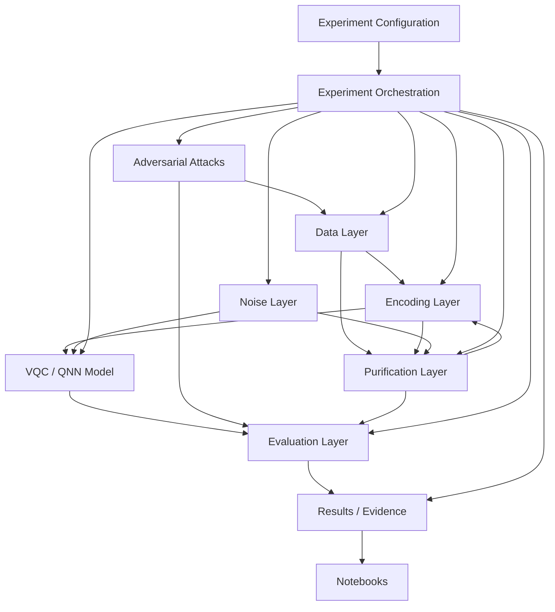
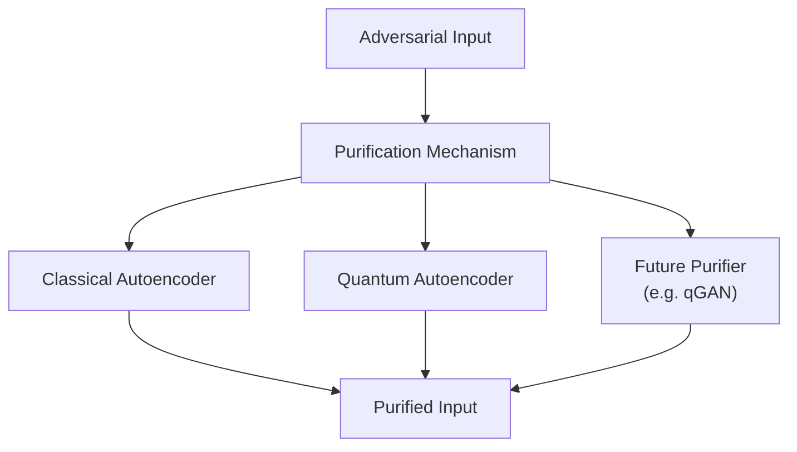
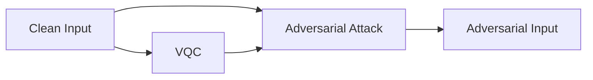
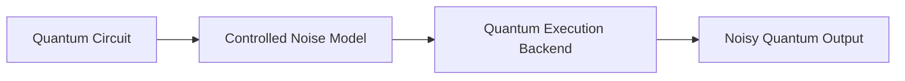

# QMLShield — Architecture

## 1. Purpose

This document defines the internal software architecture of QMLShield.

QMLShield is a research framework for evaluating adversarial robustness and purification for variational quantum classifiers. The architecture translates the research methodology into clear software boundaries while keeping the implementation small, reproducible, and extensible.

The architecture is intentionally research-oriented rather than production-oriented.

---

## 2. Architectural Goals

The architecture should:

- Keep research concepts aligned with software modules.
- Separate data, encoding, models, attacks, purification, noise, evaluation, and experiment orchestration.
- Keep experiments reproducible and configuration-driven.
- Prevent notebooks from becoming the source of truth.
- Allow CAE and QAE purification mechanisms to be compared fairly.
- Allow future purification mechanisms such as qGAN to be added without redesigning the whole system.
- Support ideal simulation first and noisy simulation later.
- Avoid premature abstractions and unnecessary framework complexity.

---

## 3. High-Level Architecture



The diagram represents logical responsibility rather than a mandatory runtime call graph. Individual experiments may use only a subset of these components.

---

## 4. Repository-to-Architecture Mapping

The repository is organized around research concepts:

```text
src/qmlshield/
├── data/
├── encoding/
├── models/
├── attacks/
├── purification/
├── noise/
├── evaluation/
├── experiments/
└── utils/
```

The corresponding responsibilities are:

| Module | Responsibility |
|---|---|
| `data/` | Dataset loading, preprocessing, splits, and data integrity |
| `encoding/` | Classical-to-quantum representation and encoding |
| `models/` | VQC/QNN models and model-level training/inference |
| `attacks/` | Adversarial perturbation generation |
| `purification/` | CAE, QAE, and future purification mechanisms |
| `noise/` | Controlled quantum-noise definitions and execution conditions |
| `evaluation/` | Metrics, comparisons, and research evaluation |
| `experiments/` | Experiment orchestration and reproducible execution |
| `utils/` | Shared technical utilities that do not define research concepts |

---

## 5. Core Architectural Boundary

The most important boundary is between **research-domain components** and **experiment orchestration**.

### Research-domain components

These implement the actual scientific mechanisms:

- Data
- Encoding
- Models
- Attacks
- Purification
- Noise
- Evaluation

### Experiment orchestration

`experiments/` coordinates these components according to a defined experimental protocol.

It should not redefine the scientific meaning of the components.

For example, an experiment may specify:

```text
load data
→ encode
→ train VQC
→ generate adversarial examples
→ purify
→ classify
→ evaluate
```

But the experiment runner should delegate each operation to its corresponding domain module.

---

## 6. Dependency Direction

The preferred dependency direction is:

```text
Experiments
    |
    +--> Data
    +--> Encoding
    +--> Models
    +--> Attacks
    +--> Purification
    +--> Noise
    +--> Evaluation

Evaluation
    |
    +--> domain outputs

Domain modules
    |
    +--> external scientific libraries
```

The following dependencies should normally be avoided:

```text
Data --------> Experiments
Models ------> Results
Purification -> Notebooks
Attacks -----> Notebooks
Domain ------> experiment-specific scripts
```

The goal is to keep domain components reusable and independently testable.

---

## 7. Research Data Flow

The main experimental path is:

```mermaid
flowchart LR
    Clean["Clean MNIST Sample"]
    Preprocess["Preprocessing"]
    Encode["Quantum Encoding"]
    VQC["Variational Quantum Classifier"]

    Attack["Adversarial Attack"]
    Adv["Adversarial Sample"]

    Purifier["Purification"]
    Purified["Purified Sample"]

    Evaluate["Evaluation"]

    Clean --> Preprocess
    Preprocess --> Encode
    Encode --> VQC
    VQC --> Evaluate

    Preprocess --> Attack
    Attack --> Adv
    Adv --> Purifier
    Purifier --> Purified
    Purified --> Encode
    Encode --> VQC

    Evaluate --> Evaluate
```



The final self-loop in the conceptual diagram is intentionally not a software dependency. In implementation, evaluation consumes experiment outputs and produces metrics/results.

---

## 8. Purification Architecture

Purification is a strategy boundary rather than a single fixed implementation.

The architecture should support:

```text
purification/
├── classical_autoencoder/
├── quantum_autoencoder/
└── future/
```

Conceptually:



The architecture does not assume that QAE is superior to CAE.

The purpose of the purification boundary is to make different mechanisms experimentally comparable under the same evaluation framework.

---

## 9. Model Architecture

The primary protected model is a variational quantum classifier.

Conceptually:

```text
Input
  ↓
Preprocessing
  ↓
Quantum Encoding
  ↓
Parameterized Quantum Circuit
  ↓
Measurement
  ↓
Prediction
```

The initial architecture should not attempt to generalize all QML model families.

QNN/VQC is the primary victim model for the first research stage.

VQA is treated as an optimization paradigm used to train parameterized quantum circuits, not as a separate model module.

---

## 10. Attack Architecture

The initial attack boundary is the classical input space.



The initial attack progression is:

```text
FGSM
  ↓
PGD
  ↓
Adaptive Attack
```

Adaptive attacks are introduced later because they must account for the complete purification-plus-classifier pipeline.

---

## 11. Noise Architecture

Quantum noise is isolated as an experimental condition.



Noise should not be represented as an adversarial attack module.

The architecture therefore distinguishes:

```text
Adversarial Perturbation
        ≠
Quantum Hardware / Simulation Noise
```

This distinction is important for maintaining a valid threat model and interpreting experimental results correctly.

---

## 12. Configuration Architecture

Experiment configuration is externalized from source code.

```text
configs/
└── baseline.yaml
```

Configuration may define:

- Dataset selection
- Classification task
- Data limits or full-dataset mode
- Random seeds
- Encoding settings
- Qubit count
- VQC architecture
- Training parameters
- Attack parameters
- Purification parameters
- Noise settings
- Evaluation settings

Scientific defaults should not be silently embedded in experiment code when they materially affect results.

---

## 13. Experiment Architecture

Experiments are organized as explicit research stages.

```text
EXP-01  Clean VQC baseline
EXP-02  FGSM vulnerability
EXP-03  PGD vulnerability
EXP-04  CAE baseline
EXP-05  QAE purification
EXP-06  CAE vs QAE comparison
EXP-07  Noise evaluation
EXP-08  Adaptive attack
```

The experiment layer is responsible for:

- Loading configuration
- Setting reproducibility controls
- Calling domain components
- Recording parameters
- Collecting outputs
- Producing evaluation artifacts

The experiment layer is not responsible for changing the underlying scientific definitions.

---

## 14. Evaluation Architecture

The evaluation layer provides common metrics across experiments.

Primary metrics include:

- Clean accuracy
- Robust accuracy
- Attack success rate
- Reconstruction error or fidelity
- Clean performance degradation
- Circuit depth
- Qubit count
- Runtime
- Shot or execution cost where applicable

The evaluation layer should make CAE and QAE comparisons use the same definitions whenever the metric is conceptually applicable.

---

## 15. Results and Evidence

Research evidence is separated from source code.

```text
results/
├── raw/
├── processed/
├── figures/
└── tables/
```

The intended flow is:

```text
Experiment
    ↓
Raw Outputs
    ↓
Processed Metrics
    ↓
Figures / Tables
    ↓
Findings
```

`findings.md` is the research interpretation layer.

Results must not be silently converted into conclusions without preserving the underlying evidence.

---

## 16. Notebook Boundary

Notebooks are for:

- Exploration
- Visualization
- Debugging
- Result inspection
- One-off analysis

Notebooks are not the source of truth for:

- Model definitions
- Attack implementations
- Purification implementations
- Experiment protocols
- Research conclusions

Reusable logic discovered in a notebook should be moved into `src/qmlshield/`.

---

## 17. External Framework Boundary

QMLShield relies on external scientific libraries, but research concepts remain owned by QMLShield.

Initial baseline:

```text
Python 3.12
uv
PennyLane
PyTorch
NumPy
SciPy
scikit-learn
pandas
Matplotlib
pytest
Ruff
Jupyter
```

External frameworks should be accessed through focused module boundaries rather than spread throughout the entire codebase.

The initial implementation does not require Qiskit, TensorFlow, or additional quantum frameworks.

---

## 18. Architecture Principles

### Research-first boundaries

Module boundaries follow the research problem rather than the organization of third-party libraries.

### Minimal complexity

Do not introduce factories, registries, plugin systems, dependency-injection frameworks, or deep inheritance hierarchies without a demonstrated need.

### Reproducibility

Experiment parameters, seeds, model settings, attack settings, purification settings, and noise conditions must be recoverable from the experiment record.

### Fair comparison

Different purification mechanisms should be evaluated under controlled and comparable conditions.

### Explicit uncertainty

The architecture must not encode assumptions such as:

```text
QAE > CAE
```

Instead, it should make comparison possible.

### Extensibility without premature abstraction

The architecture should allow future mechanisms such as qGAN purification without designing the entire framework around hypothetical future implementations.

---

## 19. Architectural Invariants

The following invariants should remain true throughout QMLShield development:

1. The VQC remains the primary protected classifier in the initial research scope.
2. Attack generation remains conceptually separate from purification.
3. Quantum noise remains separate from adversarial perturbation.
4. Evaluation uses shared definitions across comparable experiments.
5. Experiments orchestrate domain components rather than replacing them.
6. Notebooks do not become the source of truth.
7. Results are preserved separately from source code.
8. Research conclusions are based on recorded evidence.
9. New dependencies require an explicit reason.
10. Architectural complexity must be justified by an actual research or engineering need.

---

## 20. Future Extension Points

The architecture can later support:

- Additional attack methods
- Adaptive and stronger threat models
- qGAN-based purification
- Additional QAE variants
- Alternative VQC architectures
- Additional quantum encodings
- Fashion-MNIST or other datasets
- Larger classification tasks
- More realistic noise models
- Real quantum hardware
- Additional resource measurements

These are extension points, not requirements for the initial implementation.

---

## 21. Relationship to Other Documents

This document translates the research methodology into software structure.

It should be read together with:

- `system_context.md` — defines the system boundary and external context.
- `research_questions.md` — defines the research questions and hypotheses.
- `threat_model.md` — defines the security assumptions and attacker capabilities.
- `methodology.md` — defines the experimental methodology.
- `rules.md` — defines engineering and research rules.
- `tech_stack.md` — defines the technology baseline.
- `experiments.md` — defines the operational experiment sequence.
- `findings.md` — records experimental evidence and research interpretation.

---

## 22. Scope of This Architecture

This architecture describes the logical structure of QMLShield.

It does not prescribe:

- A production deployment architecture
- Cloud infrastructure
- Distributed training
- Real-time serving
- Multi-user access control
- Production observability
- Enterprise security controls
- Hardware deployment topology

Those concerns are outside the current research scope.

---

## 23. Core Architectural Statement

> **QMLShield is organized as a modular research framework in which data, encoding, VQC models, adversarial attacks, purification mechanisms, noise conditions, and evaluation remain distinct research-domain components, while experiments orchestrate them under reproducible and controlled protocols.**
