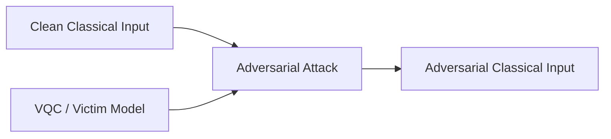
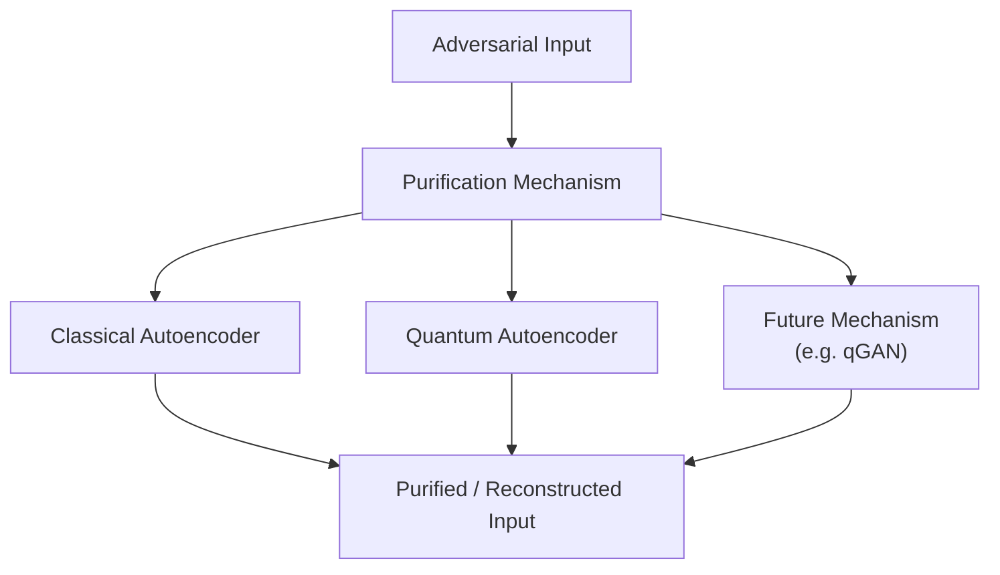
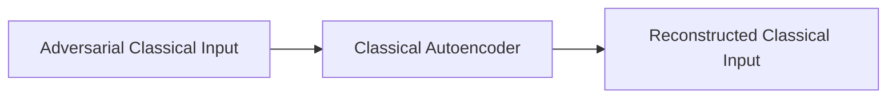
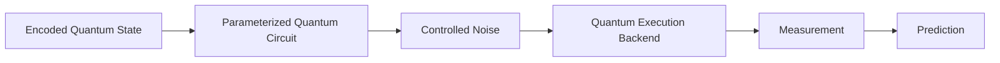
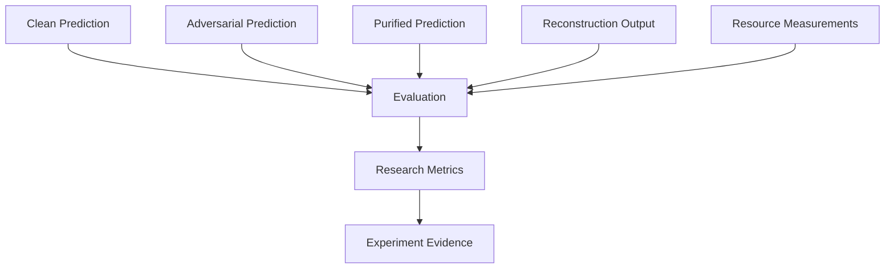
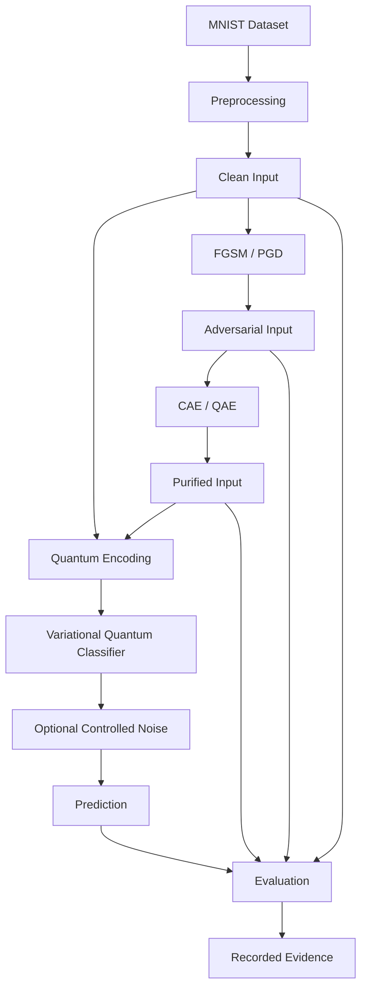
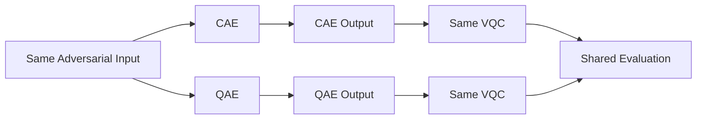
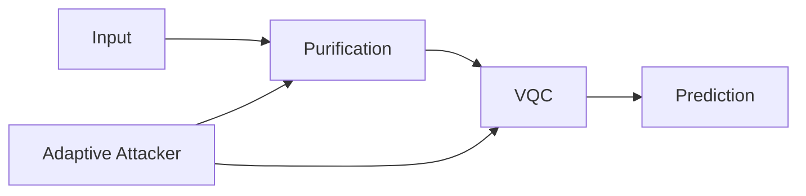

# QMLShield — Data Flow

## 1. Purpose

This document defines how data moves through the QMLShield research pipeline.

The purpose is to make the experimental data transformations explicit without prescribing implementation details. The diagram focuses on the journey from a clean dataset through preprocessing, quantum encoding, classification, adversarial perturbation, purification, and evaluation.

The data flow is designed around the initial research question:

> Can input purification improve the robustness of a variational quantum classifier against adversarial perturbations while preserving clean-input performance?

---

## 2. Data Flow Scope

The initial QMLShield data flow covers:

- Clean MNIST samples
- Preprocessed classical inputs
- Quantum-encoded representations
- VQC predictions
- Adversarial inputs
- Purified inputs
- Reconstruction outputs
- Evaluation metrics
- Experimental evidence

The flow does not currently model:

- Direct quantum-state attacks
- Training-data poisoning
- Model extraction
- Hardware-level attacks
- Production inference pipelines
- Multi-user data services

---

## 3. Core Data Objects

| Data Object | Description |
|---|---|
| `RawSample` | Original dataset sample and label |
| `PreprocessedSample` | Normalized/transformed classical input used by the experiment |
| `EncodedState` | Quantum representation produced by the selected encoding method |
| `ModelPrediction` | VQC output for an input |
| `AdversarialSample` | Classical input modified within the defined attack budget |
| `PurifiedSample` | Output reconstructed or transformed by a purification mechanism |
| `ReconstructionOutput` | Purifier-specific reconstruction information |
| `EvaluationRecord` | Metrics produced from one experiment run |
| `ExperimentEvidence` | Recorded outputs used to support later research findings |

These objects represent research concepts. Their exact Python representation is determined by implementation.

---

## 4. Clean Data Flow

The clean-input path is the reference path for all later robustness experiments.

```mermaid
flowchart LR
    Raw["Raw MNIST Sample<br/>(x, y)"]
    Preprocess["Preprocessing"]
    Clean["Clean Classical Input<br/>(x_clean, y)"]
    Encode["Quantum Encoding"]
    State["Encoded Quantum State"]
    VQC["Variational Quantum Classifier"]
    Prediction["Clean Prediction"]
    Eval["Clean Evaluation"]

    Raw --> Preprocess
    Preprocess --> Clean
    Clean --> Encode
    Encode --> State
    State --> VQC
    VQC --> Prediction
    Prediction --> Eval
```



The clean path establishes:

- Baseline classification performance
- Reference labels
- Reference input representation
- Model behavior before adversarial perturbation

---

## 5. Adversarial Data Flow

Adversarial examples are generated from the classical input under the initial threat model.



The initial attack progression is:

```text
Clean Input
    ↓
FGSM
    ↓
PGD
    ↓
Adaptive Attack
```

FGSM and PGD are the initial non-adaptive attack mechanisms.

Adaptive attacks are introduced later and optimize against the complete defense pipeline.

---

## 6. Full Adversarial Purification Flow

The central QMLShield flow is:

```mermaid
flowchart LR
    Clean["Clean Input"]
    Attack["Adversarial Attack"]
    Adv["Adversarial Input"]

    Purifier["Purification"]
    Purified["Purified Input"]

    Encode["Quantum Encoding"]
    VQC["Variational Quantum Classifier"]
    Prediction["Prediction"]
    Evaluation["Evaluation"]

    Clean --> Attack
    Attack --> Adv
    Adv --> Purifier
    Purifier --> Purified
    Purified --> Encode
    Encode --> VQC
    VQC --> Prediction
    Prediction --> Evaluation

    Clean --> Encode
    Encode --> VQC
    VQC --> Prediction
    Prediction --> Evaluation
```



This flow allows clean and purified inputs to reach the same protected classifier and evaluation framework.

The key comparison is therefore not only:

```text
adversarial → wrong prediction
```

but:

```text
adversarial
    ↓
purification
    ↓
classification recovery
```

while simultaneously checking whether:

```text
clean input
    ↓
purification
```

causes unacceptable degradation.

---

## 7. Purification Data Flow

Purification is represented as a transformation from an adversarial input to a candidate recovered input.



The purification layer must not assume successful recovery.

A purifier may:

- Recover useful structure
- Partially recover the clean input
- Fail to remove the adversarial component
- Introduce reconstruction error
- Preserve the attack
- Degrade a clean or adversarial input

These outcomes are experimental observations.

---

## 8. QAE-Specific Data Flow

For QAE experiments, the conceptual flow is:


The purpose of this representation is to show the research-level transformation.

It does not assume that every adversarial component is removed by the discarded subsystem.

Whether adversarial information survives the latent representation is an empirical question.

---

## 9. CAE Baseline Data Flow

The classical autoencoder provides a comparable classical purification baseline.



The CAE path should be evaluated using the same downstream VQC and comparable evaluation criteria where scientifically applicable.

---

## 10. Encoding Boundary

QMLShield distinguishes the classical input domain from the quantum representation domain.

```text
CLASSICAL DOMAIN
────────────────────────────────
MNIST
  ↓
Preprocessing
  ↓
Clean / Adversarial / Purified Input
  ↓
Encoding
────────────────────────────────
QUANTUM DOMAIN
  ↓
Encoded Quantum State
  ↓
VQC
  ↓
Measurement / Prediction
```

This boundary is important because the initial threat model operates in the classical input space.

The first version of QMLShield therefore does not treat direct manipulation of an already encoded quantum state as part of the primary attack path.

---

## 11. Noise-Aware Data Flow

Quantum noise is introduced at quantum execution rather than being treated as an adversarial input transformation.



The conceptual distinction is:

```text
Adversarial Perturbation
    ↓
intentional input modification

Quantum Noise
    ↓
execution/environmental condition
```

This distinction must be preserved when interpreting robustness results.

---

## 12. Evaluation Data Flow

Evaluation consumes outputs from both clean and adversarial/purified paths.



Primary metrics include:

- Clean accuracy
- Robust accuracy
- Attack success rate
- Reconstruction error or fidelity
- Clean performance degradation
- Circuit depth
- Qubit count
- Runtime
- Shot/execution cost where applicable

---

## 13. End-to-End Research Data Flow

The complete research-level flow can be summarized as:



This is the central data-flow model for the initial QMLShield research cycle.

---

## 14. Data Integrity Requirements

Each transformation should preserve enough information to support scientific comparison.

At minimum, an experiment should be able to associate:

```text
sample identity
    +
ground-truth label
    +
clean input
    +
adversarial input
    +
purified input
    +
model prediction
    +
attack configuration
    +
purification configuration
    +
noise configuration
    +
evaluation metrics
```

The exact storage schema may evolve as implementation progresses.

---

## 15. Clean vs Adversarial vs Purified Comparison

The architecture requires three conceptually distinct input states:

| State | Purpose |
|---|---|
| Clean | Establish baseline behavior |
| Adversarial | Measure vulnerability |
| Purified | Measure defense effectiveness |

A useful conceptual comparison is:

```text
                    Clean      Adversarial      Purified
                     │              │              │
                     ▼              ▼              ▼
                   VQC            VQC            VQC
                     │              │              │
                     ▼              ▼              ▼
                 Prediction     Prediction     Prediction
                     │              │              │
                     └──────────────┼──────────────┘
                                    ▼
                               Evaluation
```

This structure helps separate:

- Attack effectiveness
- Purification effectiveness
- Clean-input degradation

---

## 16. Data Flow for CAE vs QAE Comparison

The comparative experiment follows the same adversarial input:



The purpose is controlled comparison.

The architecture should avoid allowing the purifier comparison to become a comparison of unrelated victim models, datasets, or evaluation definitions.

---

## 17. Adaptive Attack Data Flow

The later adaptive setting changes the attacker objective.



The adaptive attacker is evaluated against the defense pipeline rather than only against the VQC.

This experiment answers a stronger question:

> Does purification remain effective when the attacker is aware of the defense?

---

## 18. Data Flow Invariants

The following invariants should remain true:

1. Clean, adversarial, and purified inputs remain distinguishable experimental states.
2. The VQC remains the common protected classifier for comparable experiments.
3. Attack generation and purification remain separate transformations.
4. Quantum encoding is explicit rather than hidden inside unrelated components.
5. Quantum noise is represented separately from adversarial perturbation.
6. Evaluation consumes recorded outputs rather than silently regenerating them.
7. CAE and QAE can receive comparable adversarial inputs.
8. Experimental evidence retains enough context to reproduce or interpret a result.
9. Purification success is measured rather than assumed.
10. Reconstruction quality and classification recovery are treated as related but distinct observations.

---

## 19. Relationship to Other Documents

This document provides the data-centric view of QMLShield.

It should be read together with:

- `system_context.md` — defines the system boundary and external context.
- `architecture.md` — defines software components and dependency boundaries.
- `research_questions.md` — defines what the data flow is intended to investigate.
- `threat_model.md` — defines how adversarial inputs are generated.
- `methodology.md` — defines experimental conditions and protocols.
- `rules.md` — defines data and research integrity constraints.
- `tech_stack.md` — defines implementation technologies.
- `experiments.md` — defines the operational experiment sequence.
- `findings.md` — records conclusions supported by the resulting evidence.

---

## 20. Scope of This Diagram

This document intentionally describes logical research data flow rather than:

- Python class-level data structures
- Tensor shapes for every function
- File serialization formats
- Database schemas
- Production APIs
- Network protocols
- Hardware deployment topology

Those details belong to implementation-specific documentation if they become necessary.

---

## 21. Core Data Flow Statement

> **QMLShield transforms clean classical samples into quantum classifier inputs, deliberately introduces bounded adversarial perturbations, optionally applies purification, evaluates the resulting inputs through a common variational quantum classifier, and records robustness, reconstruction, clean-performance, and resource evidence for scientific comparison.**
