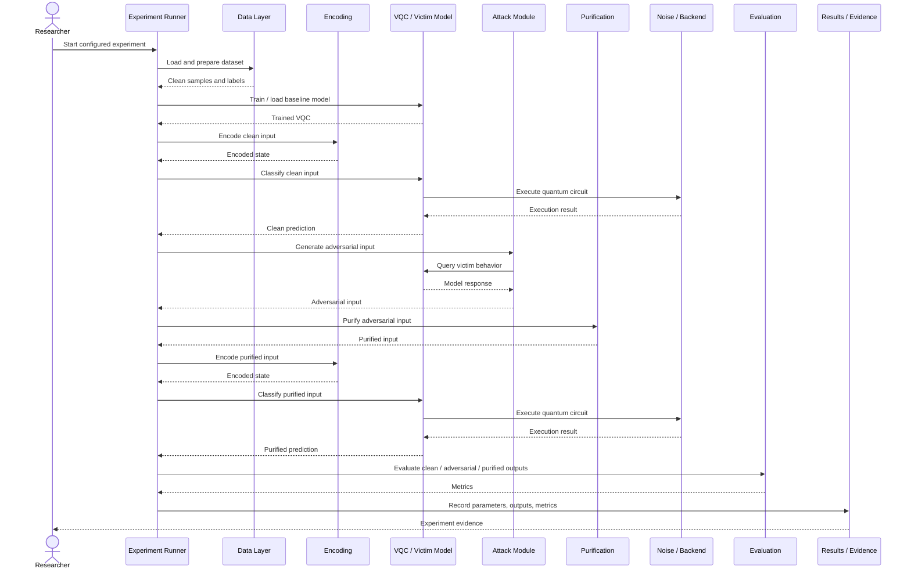
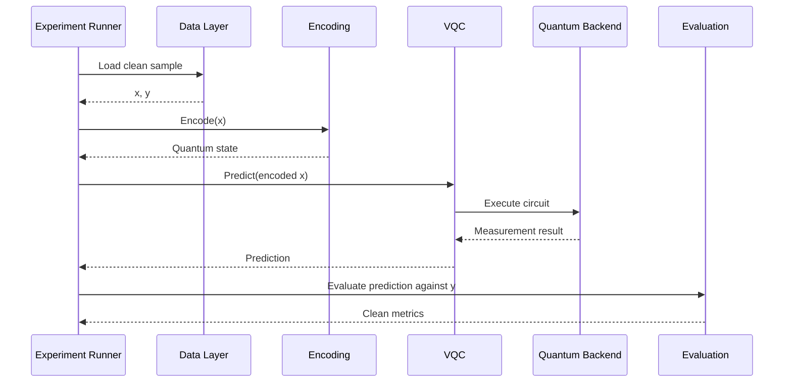
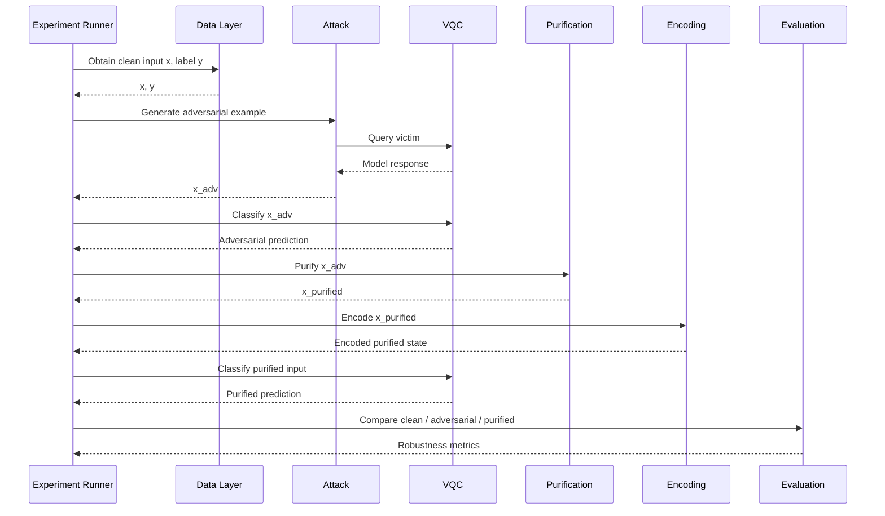
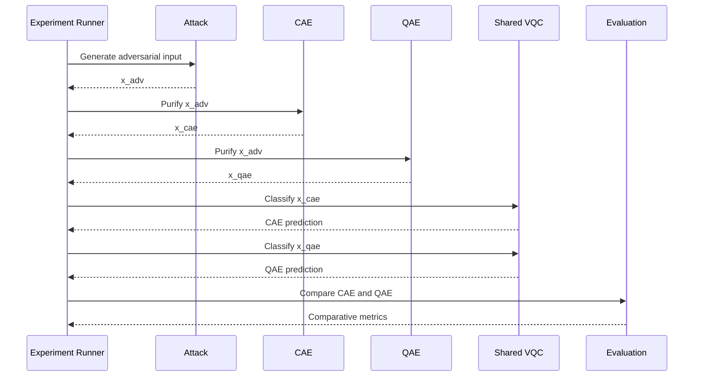
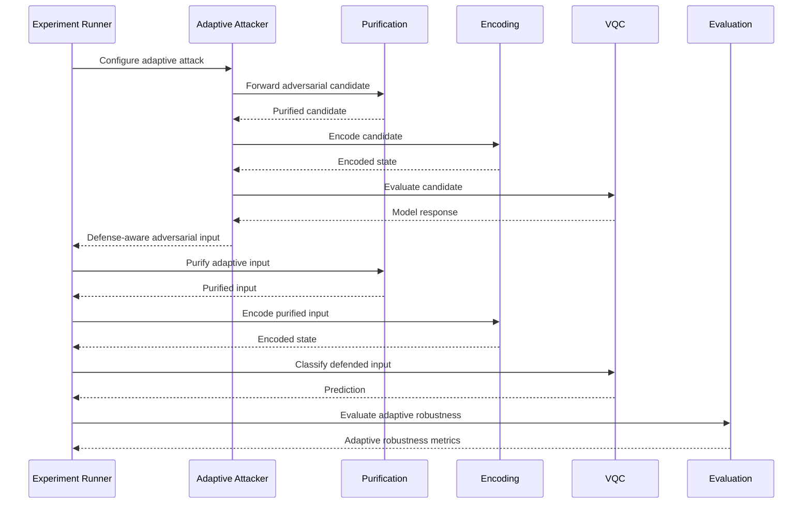
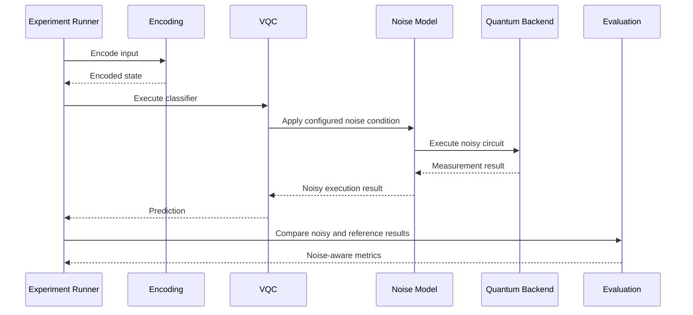
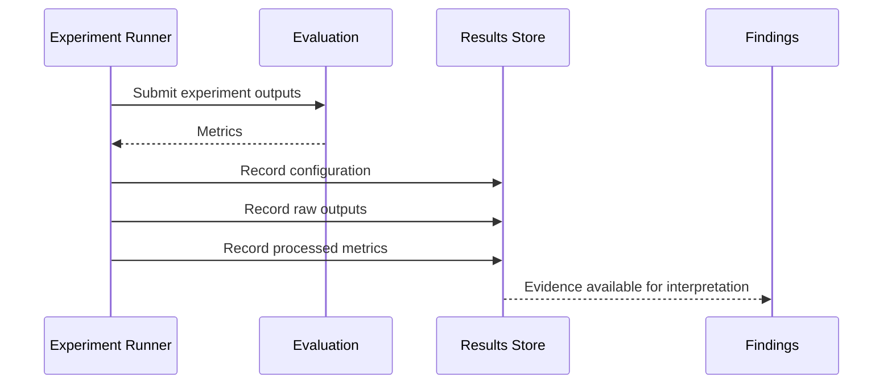

# QMLShield — Sequence

## 1. Purpose

This document defines the principal runtime sequence of a QMLShield research experiment.

The sequence diagram focuses on how the main research components interact during an adversarial purification experiment. It complements:

- `system_context.md` — system boundary and external context
- `architecture.md` — internal component boundaries
- `data_flow.md` — movement and transformation of research data
- `threat_model.md` — attacker capabilities and assumptions
- `methodology.md` — experimental protocol

The sequence is intentionally compact. It describes the canonical research execution path rather than every implementation-level function call.

---

## 2. Primary Sequence

The canonical QMLShield experiment can be represented as:



This sequence describes the core experimental interaction. Specific experiments may omit or repeat stages depending on their purpose.

---

## 3. Sequence Responsibilities

### Researcher

The researcher:

- Defines the research question being tested.
- Selects the experiment configuration.
- Defines the relevant threat-model assumptions.
- Reviews the resulting evidence.

The researcher does not manually perform the computational pipeline during normal experiment execution.

### Experiment Runner

The experiment runner orchestrates the sequence.

It is responsible for:

- Loading configuration
- Establishing reproducibility settings
- Calling domain modules
- Maintaining experiment identity
- Collecting outputs
- Sending results to evaluation and evidence recording

It should not contain the scientific implementation of attacks, models, or purification mechanisms.

### Data Layer

The data layer:

- Loads the selected dataset.
- Applies defined preprocessing.
- Produces clean samples and labels.

### Encoding

The encoding layer converts the classical representation into the quantum representation required by the VQC.

### VQC / Victim Model

The VQC is the primary protected classifier.

It:

- Trains or loads model parameters.
- Receives encoded inputs.
- Executes the parameterized quantum circuit.
- Produces predictions.

### Attack Module

The attack module generates adversarial examples under the defined threat model.

The initial progression is:

```text
FGSM → PGD → Adaptive Attack
```

The attack module does not perform purification.

### Purification

The purification module transforms an adversarial input into a candidate purified input.

Initial mechanisms:

```text
CAE
QAE
```

Future mechanisms such as qGAN can be introduced through the same conceptual boundary.

### Noise / Backend

The noise/backend boundary represents the quantum execution environment.

It may provide:

- Ideal execution
- Controlled noisy simulation
- Optional later real-QPU execution

Noise is an execution condition, not an adversarial attack.

### Evaluation

The evaluation layer compares outputs and computes research metrics.

### Results / Evidence

The results layer records the experimental configuration, outputs, metrics, and evidence needed for later interpretation.

---

## 4. Clean Baseline Sequence

The clean baseline establishes the reference behavior before adversarial experiments.



The clean baseline should be established before interpreting adversarial robustness.

---

## 5. Non-Adaptive Adversarial Sequence

The initial attack sequence assumes the attacker operates against the VQC without optimizing specifically against the purification mechanism.



The important property is that the attacker is not initially optimized against the complete purification pipeline.

---

## 6. CAE vs QAE Comparison Sequence

CAE and QAE should receive comparable adversarial inputs under controlled experimental conditions.



The shared VQC and shared evaluation definitions help isolate the effect of the purification mechanism.

---

## 7. Adaptive Attack Sequence

The adaptive sequence is a later-stage experiment.

The attacker is aware of the defense pipeline and optimizes against the complete defended model.



This sequence tests whether the observed defense benefit survives a stronger attacker model.

---

## 8. Noise-Aware Sequence

Noise experiments introduce controlled execution conditions without redefining the attack model.



The noise condition is an experimental variable.

It is not itself treated as an adversarial perturbation.

---

## 9. Result Recording Sequence

Research evidence should be recorded after an experiment produces its outputs.



`findings.md` is an interpretation layer rather than a runtime component.

It should not be treated as part of the computational execution path.

---

## 10. Experiment Progression

The sequence architecture supports the planned experiment progression:

```text
EXP-01
Clean VQC Baseline
      ↓
EXP-02
FGSM Vulnerability
      ↓
EXP-03
PGD Vulnerability
      ↓
EXP-04
CAE Baseline
      ↓
EXP-05
QAE Purification
      ↓
EXP-06
CAE vs QAE
      ↓
EXP-07
Noise Evaluation
      ↓
EXP-08
Adaptive Attack
```

Not every experiment uses the complete primary sequence.

For example:

- EXP-01 focuses on clean classification.
- EXP-02 and EXP-03 establish vulnerability.
- EXP-04 and EXP-05 evaluate individual purification mechanisms.
- EXP-06 performs controlled comparison.
- EXP-07 introduces execution noise.
- EXP-08 strengthens the attacker model.

---

## 11. Sequence-Level Research Invariants

The following interaction properties should remain stable:

1. The experiment runner orchestrates rather than reimplements domain logic.
2. The VQC remains the primary protected classifier.
3. The attacker and purifier remain separate components.
4. Clean behavior is measured before robustness claims are interpreted.
5. CAE and QAE can be evaluated through a common downstream VQC.
6. Noise remains an execution condition separate from adversarial attack generation.
7. Adaptive attacks are evaluated against the complete defense pipeline.
8. Evaluation consumes explicit experiment outputs.
9. Evidence is recorded before research conclusions are written.
10. A successful purification result is an empirical outcome, not an architectural assumption.

---

## 12. Sequence Boundary

This document intentionally stops at research-component interaction.

It does not define:

- Python method calls
- Function signatures
- Tensor-level operations
- Class constructors
- Threading or multiprocessing
- Distributed execution
- API protocols
- Cloud orchestration
- Hardware control commands

Those details should only be documented when implementation complexity makes them necessary.

---

## 13. Relationship to Other Documents

The sequence diagram connects the three preceding architectural views:

```text
System Context
      ↓
Architecture
      ↓
Data Flow
      ↓
Sequence
```

Their responsibilities are distinct:

| Document | Primary Question |
|---|---|
| `system_context.md` | What surrounds QMLShield? |
| `architecture.md` | What are the major internal components? |
| `data_flow.md` | How does research data move? |
| `sequence.md` | How do the components interact over time? |

The remaining research documents provide the scientific constraints for these interactions.

---

## 14. Core Sequence Statement

> **A QMLShield experiment is orchestrated as a controlled sequence in which clean data establishes a baseline, an attacker generates bounded perturbations, purification optionally transforms adversarial inputs, the common VQC evaluates the resulting inputs under defined execution conditions, and the evaluation layer records evidence for scientific comparison.**
