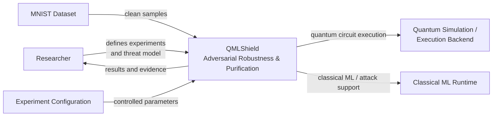

# QMLShield — System Context

## 1. Purpose

This document defines the system-level context of QMLShield.

QMLShield is a research framework for studying adversarial robustness and input purification for Quantum Machine Learning (QML), with a primary focus on variational quantum classifiers.

The system context intentionally stays above implementation details. It identifies the main system boundary, external actors, external dependencies, protected asset, and the high-level research flow.

---

## 2. System Boundary

The QMLShield system boundary contains the experimental components required to evaluate adversarial purification for a variational quantum classifier:

- Dataset and preprocessing pipeline
- Classical-to-quantum encoding
- Variational Quantum Classifier (VQC)
- Adversarial attack generation
- Classical Autoencoder (CAE) purification baseline
- Quantum Autoencoder (QAE) purification
- Noise simulation
- Evaluation and experiment orchestration
- Research result recording

QMLShield does **not** currently claim to cover all QML models, all quantum security threats, or all quantum hardware attacks.

---

## 3. External Entities

### Dataset Source

Provides the clean dataset used by QMLShield.

The initial experimental setting uses MNIST, with binary classification as the first research stage.

### Researcher

Defines experiments, threat-model assumptions, configurations, and evaluation criteria. The researcher also interprets experimental evidence.

### Quantum Simulation / Execution Backend

Provides the computational environment in which quantum circuits are executed.

The initial workflow prioritizes ideal and noisy simulation. Real quantum hardware is an optional later extension.

### Classical ML Framework

Supports classical components such as preprocessing, adversarial attack optimization, and the CAE baseline.

### Experiment Configuration

Defines controlled experimental parameters such as model settings, attack parameters, purification settings, noise conditions, seeds, and dataset choices.

---

## 4. Protected Asset

The primary protected asset is the **integrity of the VQC classification decision**.

QMLShield evaluates whether adversarially perturbed inputs can cause an incorrect classification and whether purification can recover inputs sufficiently for the VQC to produce the intended prediction.

Clean-input performance is also protected as a critical secondary property. A defense should not achieve robustness by causing unacceptable degradation on clean inputs.

---

## 5. High-Level Context

The research flow can be summarized as:

```text
Clean Dataset
     |
     v
Preprocessing + Encoding
     |
     v
Variational Quantum Classifier
     |
     +----------------------+
     |                      |
     v                      v
Clean Evaluation      Adversarial Attack
                            |
                            v
                     Adversarial Input
                            |
                            v
                       Purification
                       /          \
                     CAE          QAE
                       \          /
                        \        /
                         v      v
                       VQC Evaluation
                            |
                            v
                  Robustness + Accuracy
                  + Reconstruction +
                  Resource / Noise Analysis
```

This flow represents the research pipeline rather than a claim that every experiment executes every component simultaneously.

---

## 6. System Context Diagram



---

## 7. Research-Level Interaction

At the system level, QMLShield performs the following interaction:

1. The researcher defines a controlled experiment.
2. A clean dataset is loaded and preprocessed.
3. Inputs are encoded for quantum processing.
4. A variational quantum classifier establishes the primary prediction task.
5. An adversarial attacker generates perturbed inputs under the defined threat model.
6. Purification mechanisms process adversarial inputs.
7. The VQC evaluates the resulting inputs.
8. QMLShield measures clean performance, robustness, reconstruction behavior, and computational/quantum resource trade-offs.
9. Experimental evidence is recorded for later analysis.

---

## 8. Security and Research Boundary

The initial QMLShield threat model is intentionally narrow:

- The attacker operates in the classical input space.
- The attacker is initially treated as a white-box adversary.
- Perturbations are bounded by an explicit attack budget.
- FGSM and PGD are the initial attack mechanisms.
- Direct manipulation of quantum states, gates, measurements, or hardware is outside the initial scope.
- Quantum noise is treated as an experimental condition, not as the same phenomenon as an adversarial perturbation.
- Adaptive attacks against the complete purification-plus-classifier pipeline are a later research stage.

This boundary keeps the first version experimentally tractable and makes the security claims precise.

---

## 9. Context Diagram Principles

The system context should remain stable even if internal implementations change.

For example:

- VQC remains the primary protected classifier even if its circuit architecture changes.
- QAE may be replaced or supplemented by another purification mechanism.
- The quantum backend may move from simulation to real hardware.
- The attack library may expand beyond FGSM and PGD.
- Additional datasets may be introduced for generalization experiments.

These changes should normally affect lower-level architecture or methodology documents rather than redefine the system context.

---

## 10. Relationship to Other Documents

This document provides the highest-level system view for QMLShield.

It should be read together with:

- `research_questions.md` — defines what the research is trying to answer.
- `threat_model.md` — defines the attacker, attack surface, assumptions, and security boundaries.
- `methodology.md` — defines how the research questions are experimentally tested.
- `architecture.md` — defines the internal software architecture.
- `rules.md` — defines engineering and research constraints.
- `tech_stack.md` — defines the technology baseline.
- `experiments.md` — defines the operational experiment sequence.
- `findings.md` — records experimental evidence and conclusions as they emerge.

---

## 11. Scope of This Diagram

The system context diagram intentionally does not describe:

- Individual Python classes
- Internal module dependencies
- Quantum circuit gate layouts
- Exact attack algorithms
- Dataset tensors
- Training loops
- Experiment file formats
- Deployment infrastructure
- Production security controls

Those concerns belong to lower-level documents and implementation artifacts.

---

## 12. Core Statement

> **QMLShield is a research framework for evaluating whether purification can improve the adversarial robustness of variational quantum classifiers while preserving clean-input performance under controlled experimental conditions.**
